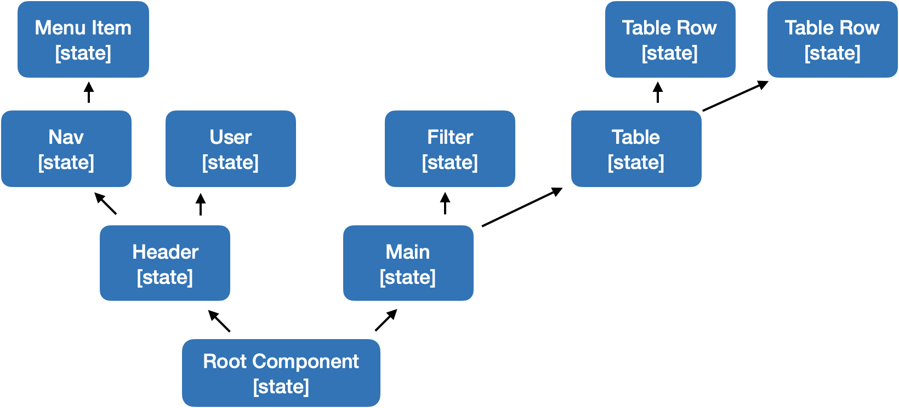
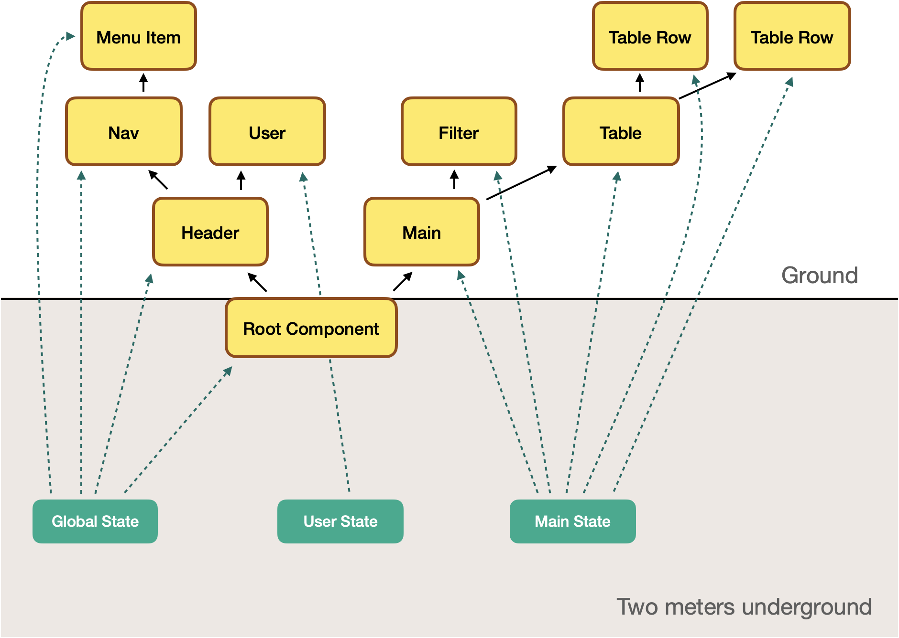

# Jinkela 是什么？

Jinkela（金坷垃）<del style="opacity:.3;">是一种肥料添加剂</del> 自认为是一个**前端框架**。

其核心思想是：**尽可能地使用规范内的特性，让代码无需构建就能在浏览器上跑起来**。

适合用来快速搭建一个小而轻的工具类页面，适合交互密集型的组件开发，在大型多人协作项目上似乎没有优势。

# 快速上手

## 1. 数据绑定

Jinkela 的核心设计是将 JS 标准的字符串模板解析为组件。并且在字符串模板变量填充的位置实现了响应式的数据绑定机制。

```typescript
import { jkl, createState } from 'jinkela';

const s = createState({ who: 'Jinkela' });

const div = jkl`<h1>Hello ${() => s.who}<h1>`;

document.body.appendChild(div);
```

看吧，是不是贼简单？Jinkela 会动态分析出 Hello 后面的文本节点所依赖的状态，一旦 `s.who` 的值变化，DOM 对应的文本节点数据也会随之变化。

你可以点击代码片段右上角的「Try」在新页面运行这段代码，同时可以在浏览器控制台修改 `s.who` 的值，观察页面的变化。

除了文本节点的数据绑定外，元素属性同样支持数据绑定，甚至一个元素属性可以部分是变量，比如下面是在 style 属性中加入变量：

```typescript
import { jkl, createState } from 'jinkela';

const s = createState({ who: 'Jinkela', color: 'gold' });

const div = jkl`
  <div style="font-size: 32px; color: ${() => s.color};">
    Hello ${() => s.who}
  <div>`;

document.body.appendChild(div);
```

当 `s.color` 改变时，页面显示的文字颜色也会随之变化。

## 2. 分支与循环

区别于一些现代前端框架通过私有元素属性（如 if、repeat）来组织页面，Jinkela 的写法更像 JSX，通过 js 原生的循环和判断来描述。比如下面这个例子，加载一份异步数据，在数据加载完成前，页面显示为加载中的状态，数据加载完成后，把数据以列表的形式渲染出来。

```typescript
import { jkl, createState } from 'jinkela';

const s = createState({ loading: true, data: null });

setTimeout(() => {
  s.loading = false;
  s.data = [
    { id: 1, name: 'Buildless' },
    { id: 2, name: 'Lightweight' },
    { id: 3, name: 'Responsive' },
  ];
}, 1500);

const div = jkl`
  <div>
    <h2>What are the benefits of Jinkela?</h2> 
    ${() => {
      if (s.loading) return jkl`<span>Waiting...</span>`;
      return jkl`
        <ul>
        ${() => {
          return s.data.map((i) => jkl`<li>${i.name}</li>`);
        }}
        </ul>
      `;
    }}
  <div>`;

document.body.appendChild(div);
```

## 3. 事件语法糖

给元素添加 `@` 开头的属性时候，Jinkela 会将其作为事件注册到元素上。比如下面这个例子就是给 div 里的 button 绑定了 click 事件。按钮点击之后往 `list` 里面增加一个 li 元素。每个 li 元素里面有一个 remove 按钮，点击后将从 `list` 中删除 li 自身。

```typescript
import { jkl, createState } from 'jinkela';

const list = createState([]);

const click = () => {
  const remove = () => {
    const index = list.indexOf(li);
    if (index !== -1) list.splice(index, 1);
  };
  const li = jkl`
    <li>
      ${new Date()}
      <button @click="${remove}">remove</button>
    </li>
  `;
  list.push(li);
};

const div = jkl`
  <button @click="${click}">+1</button>
  <ul style="line-height: 1.75;">
    ${() => [...list]}
  </ul>
`;

document.body.appendChild(div);
```

## x. 小结

1. 组件模板字符串
2. 分支循环写原生
3. 事件前面加 @

你学废了吗？

# 设计理念

## 1. 状态与视图分离

绝大多数前端框架都将状态和视图一起包装成组件，「状态」一词潜移默化地变成了特指组件的状态。而在 Jinkela 的设计中，状态是可以单独存在的，视图与状态之间可以自由结合，是多对多的关系。

假如有两个无关的组件，他们都要展示当前时间，咋写？一般的思路就是每个组件单独开计时器计算当前时间，带来的问题是一旦这样的组件用多了，整个页面就需要开启大量的定时器。优化一下的方案就是引入一个外部的状态管理器，两个组件共同订阅上面是时间数据，数据变化时去更新组件自己的状态。这个方案的思路是很清晰的，但有两个让人不舒服的点。一是要引入外部状态管理器，增加了外部依赖。二是要从外部的状态管理器将数据同步到组件的状态上，这个过程太绕了。

从外部状态管理器的普及程度来看，大家对「状态被限制在组件范围内」的前端框架是不满意的。既然要引入外部状态管理器，为什么不从框架设计层面就直接把这层屏障打开呢？这就好比是既然植物要吸收氮磷钾，为什么不直接让植物能够吸收地下两米的氮磷钾呢？

下面这张图是一个典型的页面对应的一棵组件树，从根组件开始，到一个个叶组件，每个组件都在维护自己的状态。



而 Jinkela 状态与视图分离的设计就可以让原本看似无关的组件复用同一个状态。这便是 Jinkela 的核心理念之 **状态属于 Model 而不是 View**。



所以回到前面多组件展示当前时间的问题，Jinkela 的代码可以这么写。

```typescript
import { jkl, createState } from 'jinkela';

const s = createState({
  update() {
    const t = new Date();
    this.hours = t.getHours();
    this.minutes = t.getMinutes();
    this.seconds = t.getSeconds();
    setTimeout(() => this.update(), 100);
  },
});

s.update();

const c1 = jkl`
  <h1>
    ${() => s.hours}:${() => s.minutes}:${() => s.seconds}
  </h1>`;

const c2 = jkl`
  <h2>
    Current Time: ${() => s.hours}:${() => s.minutes}:${() => s.seconds}
  </h2>`;

document.body.appendChild(c1);
document.body.appendChild(c2);
```

## 2. 还没想好咋编

TODO

# 详细文档

别急，文档正在逐步完善中。
